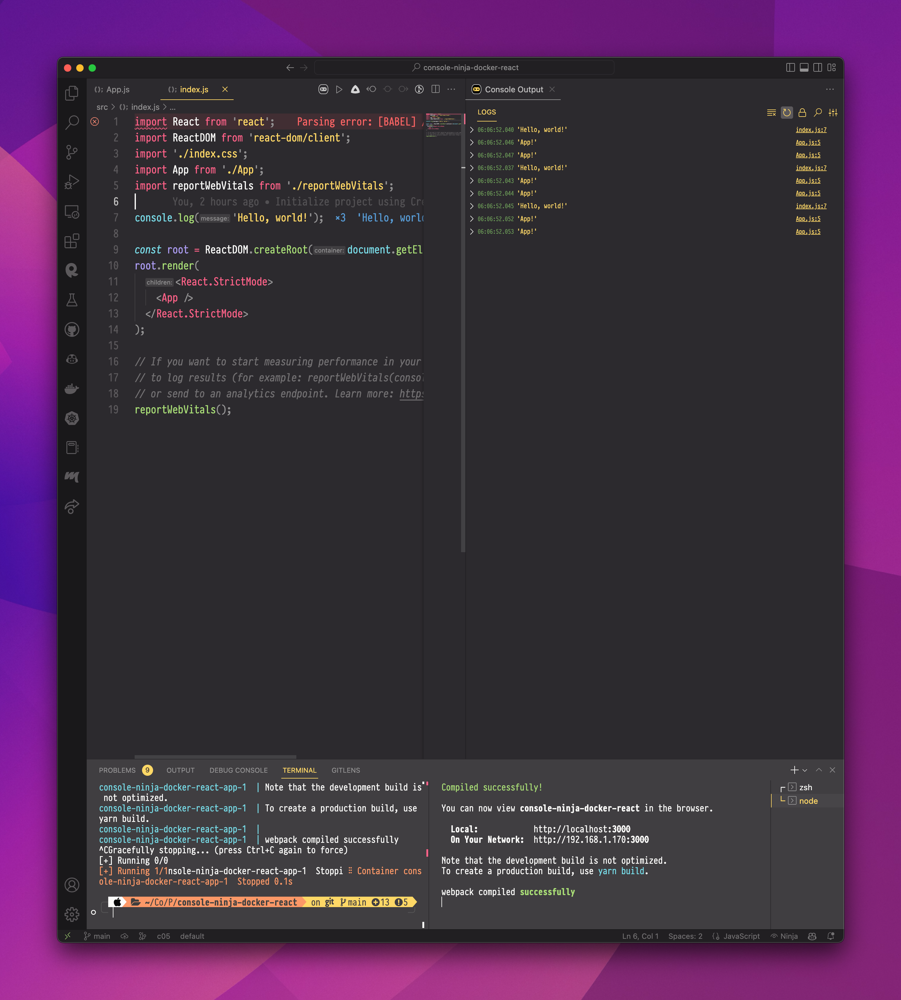

# Console Ninja/Docker Compose
This app reproduces, in part, the issue raised in [#2](https://github.com/wallabyjs/console-ninja/issues/2).

## Reproduction case
Starting from a bare Create React App repo, I've ejected the app to ensure it's running Webpack and created [a Docker Compose file](./docker-compose.yml) that mounts the app in a standard Node 16 container. The setup is as naïve as possible: I've avoided customization to prevent introducing bugs unrelated to Console Ninja. From there, I added `console.log` statements to [`App.js`](src/App.js) and [`index.js`](src/index.js). I made no other code changes.

As expected, running `yarn start` from a Visual Studio Code terminal connects Console Ninja.



<details>
<summary>
    <strong>Console Ninja trace log: outside container</strong>
</summary>

```
info host ------------ starting ------------
info extension
info host worker Starting Host Worker...
info host client connected: extension { address: '::', family: 'IPv6', port: 53887 }
info host starting host: {"extensionFolder":"/Users/daniel/.vscode/extensions/wallabyjs.console-ninja-0.0.54","runtimeHookFile":"/Users/daniel/.vscode/extensions/wallabyjs.console-ninja-0.0.54/out/runtimeHook/tracer.js","globalErrorHandlerFile":"/Users/daniel/.vscode/extensions/wallabyjs.console-ninja-0.0.54/out/runtimeHook/errorHandler.js","filesToInstrument":["/Users/daniel/Code/Personal/console-ninja-docker-react/src/App.js","/Users/daniel/Code/Personal/console-ninja-docker-react/src/index.js","/Users/daniel/Code/Personal/console-ninja-docker-react/scripts/build.js","/Users/daniel/Code/Personal/console-ninja-docker-react/scripts/start.js"],"debug":false,"config":{"dateTimeFormat":"hh:mm:ss.SSS","openLinksInEditor":true,"maxLogViewerEntries":15000,"autoClearLogViewerOnFileChanges":true,"outputMode":"Beside File","toolsToAutoPatch":["vite","jest","webpack","next.js","cypress","http-server","serve","nuxt","remix","hydrogen","live-server","live-preview"]},"allowedHosts":["localhost","127.0.0.1","example.cypress.io","heather","192.168.1.170","169.254.248.110"],"host":"127.0.0.1"}
info host starting tools discovery and integration
info host looking for tools to patch
info host found 6 tool file(s) to patch
info host patching /Users/daniel/.vscode/extensions/ritwickdey.liveserver-5.7.9/node_modules/live-server/index.js
info host patching /Users/daniel/.vscode/extensions/ms-vscode.live-server-0.4.4/out/extension.js
info host patching /Users/daniel/Code/Personal/console-ninja-docker-react/node_modules/webpack/lib/index.js
info host patching /Users/daniel/Code/Personal/console-ninja-docker-react/node_modules/webpack/lib/webpack.js
info host patching /Users/daniel/Code/Personal/console-ninja-docker-react/node_modules/jest/bin/jest.js
info host patching /Users/daniel/Code/Personal/console-ninja-docker-react/node_modules/jest-runner/build/testWorker.js
info host completed tools discovery and integration
```

</details>

The problem arises from the absolute paths in the Webpack instrumentation:

```js
/* build-hook-start *//*00001*/try { require('/Users/daniel/.vscode/extensions/wallabyjs.console-ninja-0.0.54/out/buildHook/index.js').default({tool: 'webpack'}); } catch(e) { try { import('file:///Users/daniel/.vscode/extensions/wallabyjs.console-ninja-0.0.54/out/buildHook/index.js').then(m => m.default.default({tool: 'webpack'})).catch(p => {}) } catch(e) { }}/* build-hook-end */
```

`docker-compose.yml` creates a bind mount for the entire repo, _including_ `node_modules`. If I run `docker compose up` and `docker compose exec app head node_modules/webpack/lib/index.js`, I can see the same snippet installed inside the container. But `/Users/daniel/.vscode` only exists on my host machine. If I add `console.error` to those `catch` statements, I can see that the `require` call still throws the original poster's error:

```
yarn run v1.22.19
$ node scripts/start.js
Error [ERR_MODULE_NOT_FOUND]: Cannot find module '/Users/daniel/.vscode/extensions/wallabyjs.console-ninja-0.0.54/out/buildHook/index.js' imported from /app/node_modules/webpack/lib/index.js
    at new NodeError (node:internal/errors:387:5)
    at finalizeResolution (node:internal/modules/esm/resolve:330:11)
    at moduleResolve (node:internal/modules/esm/resolve:907:10)
    at defaultResolve (node:internal/modules/esm/resolve:1115:11)
    at nextResolve (node:internal/modules/esm/loader:163:28)
    at ESMLoader.resolve (node:internal/modules/esm/loader:841:30)
    at ESMLoader.getModuleJob (node:internal/modules/esm/loader:424:18)
    at ESMLoader.import (node:internal/modules/esm/loader:525:22)
    at importModuleDynamically (node:internal/modules/cjs/loader:1104:29)
    at importModuleDynamicallyWrapper (node:internal/vm/module:438:21) {
  code: 'ERR_MODULE_NOT_FOUND'
}
```

Mounting packages inside the Docker container is not a best practice, but it's tough to avoid.


## Paths to resolution
A working Docker integration would require at least two changes: a containerized script and a stable port.

The code at `$HOME/.vscode/extensions` needs to run inside _the container_ without explicit references to paths and modules on _the_ host_. Developers generally configure Docker to mount a single repo, so you'd have to inject the integration script at a known path under `$PWD`. `node_modules` is an obvious candidate.

I'm gleaning from the trace logs that the VSCode extension communicates with the instrumentation script over an automatically assigned port. But a port number must be explicitly exposed on the container for the host machine to see it. In the Compose file, `ports` can specify a `target`, the port inside the container to which an app binds, and a `published` port, which Docker connects to the container's `target`.

```yaml
ports:
  # Connect an app running on port 3000 inside Docker to the same port on the
  # host.
  - target: 3000
    published: 3000
    protocol: tcp
    mode: host
  # Connect the same app, bound to port 3000 inside the container, to port 3333 on
  # the host.
  - target: 3000
    published: 3333
    protocol: tcp
    mode: host
  # Connect the port 3000 inside the container to a random ephemeral port on the
  # host.
  - target: 3000
    protocol: tcp
    mode: host
```

I don't have any clever suggestions for this one: syncing an agreed-upon port between Docker, VSCode, the extension script, and the developer sounds like a nightmare.
